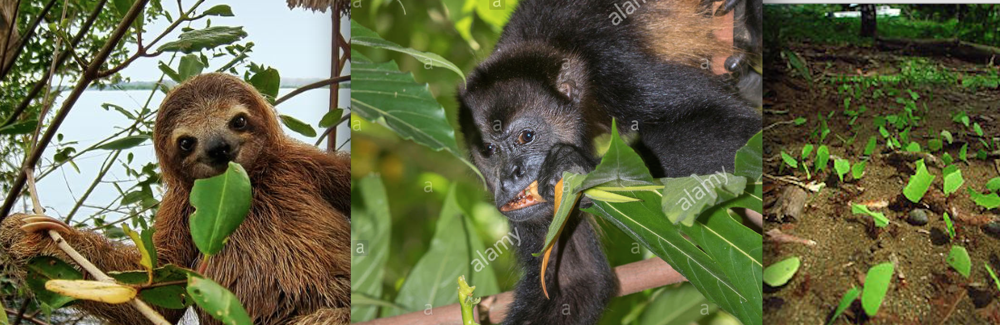

```{r setup, include=FALSE}
knitr::opts_chunk$set(
  echo = TRUE, 
  warning = FALSE, 
  comment = "##", 
  prompt = FALSE, 
  tidy = TRUE, 
  tidy.opts = list(width.cutoff = 75)
  )
```

#Preliminaries 
Please install these packages first: 

#Objectives
In this module we will examine Discriminate Function Analysis, a pattern-recognition statistical method that characterizes or seperates two or more classes of objects or events. We will go over the different uses of DFAs, work through a basic example by hand in R, and will end with running an analysis together using actual data. 
Key concepts: Discriminant scores, 

#The Basics
Discriminate Function Analysis (DFA) is a populate statistical method used to determine which continuous independent variables discriminate between two or more categorical variables in such a way that the differences between predefined groups are maximized. 

Last week we learned about Principal Component Analysis, a technique to describe the relationship and structure in data. We saw how useful it can be in finding the correlations between variables in multivariate data.
Discriminant function analysis is very similar to PCA. The major difference is that PCA calculates the best discriminating variables without prior knowledge about groups, whereas DFA calculates the best disciminating variables (=disciminants) for groups that are defined by the user.

DFA's are good tools for:  
**Visualizing multivariate data***  
**Understanding the most meaningful sources of variance in your data**  
**Understanding the best descriminating variables in your data, with prior knowledge about groups**  
**Predicting categorical groups**  
**Determining which variables best predict groups**
**Reducing the changes of misclassifying your unknown data**  

Biologically, you might use a DFA to determine which variables discriminate between leaves eaten by 1) sloths  2) howler monkeys 3) leaf ants. For that purpose, the biologist would collect data on numerous leaf characteristics of those species eaten by each of the animal groups. Ideally, most leaves will naturally fall into one of these three categories. DFA could then be used to determine which variables are the best predictors of whether a leaf will be eaten by sloths, monkeys, or ants. 



DFA is like the reverse of a MANOVA, which is used to predict multiple continuous dependent variables by one or more independent categorical variables. Instead, DFA is a powerful predictor tool, and useful in determining whether a set of variables is actually effective in predicting categories. This means that DFA can only be used when groups are known a priori. You can think of DFA as a classification, with the proper dataset, DFA can distribute things into groups of the same type.  
  
Discriminant analysis works by producing one or more linear combinations of predictor variables, creating a new underlying variable for each function. These functions are called discriminant functions. The number of possible functions is the number of groups minus one (ng - 1), or the number of predictors whichever is smaller. The first discriminant function, similar to the first principal component, maximizes differences between group on that function. The second function does the same, but also must not be correlated with the previous function, this continues for the rest of the functions.   

[Simple Graphic Example on the board]

Here is a animations showing how some projections of data are able to discriminate data better than others:
 

# Definitions
**Variance:** A measure (similar to standard deviation) of how much spread, or range, is present in your dataset.  
**Covariance:** A measure of how variables vary from the mean with respect to each other.  
**Discriminant score:** the weighted linear combination (sum) of the discriminating variables or predictors  
**Discriminant coefficient:** The correlation between each predictor variable and the discriminant score of each function.    
**Standardized coefficients:** each predictor's unique contribution to each function (this is a partial correlation). This number indicates the relative importance of each predictor in predicting group assignment from each function.   
**Linear discriminant function analysis:** Method most often used, DFA when all the assumptions are met. AKA Fischer LDA, AKA Linear Discriminant, AKA Canonical Variate...  
**Quadratic discriminant function analysis:** Used when you can't meet assumptions for linear, i.e. Homogeneity of variances/covariances
**Jackknife:** A resampling technique (similar to bootstrapping) without replacement.

# Assumptions: The assumptions of DFA are the same as those for MANOVA.   
**Sample Size:** Sample size does not have to be equal. However, the sample size of the smallest group must be greater than the number of predictor variables.    

**Normal Distribution:** DFA assumes the data represent a sample from a multivariate normal distribution.  

**Homogeneity of variances/covariances:** DFA is sensitive to heterogeneity of variance-covariance matrices.  

**Outliers:** DFA is also very sensitive to the inclusion of outliers. It is recommended to run a test for univariate and multivariate outliers for each group, and elimate or transform the outliers.   

**Non-multicollinearity:** The independent variables should not be highly correlated with another. Also must be low multicollinearity of the independents.  


